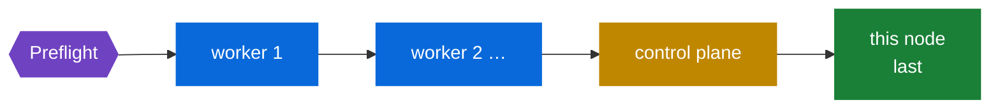
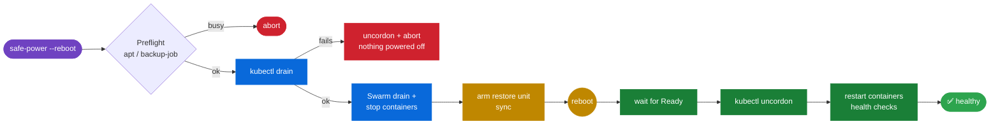

# ⚡ safe-power


Safe **reboot / shutdown** for the optiplex cluster: drain first, power second, and put everything back automatically on boot. Run it on any node, and point it at any node.

| Script | Purpose |
|---|---|
| 🟢 **`safe-power`** | Drain, then reboot or shut down, then restore. |
| 🔵 **`safe-power-setup`** | One-time setup: service account, SSH keys, sudo rule, and Kubernetes permissions on every node. |

---

## 🚀 Install

> [!IMPORTANT]
> Do this **once** from any node, logged in as your normal admin user. That user needs SSH access and `sudo` on every node. You'll be asked for passwords during setup; after that, nothing asks for a password.

**1. Get the scripts onto any one node**

```bash
git clone https://github.com/BladerunnerxRC/Linux_Shell_Scripts.git
cd Linux_Shell_Scripts/safe-power
```

**2. Run setup with every node's hostname** (the control plane is `optiplex-docker` by default)

```bash
./safe-power-setup optiplex-docker optiplex-two optiplex-three
```

**3. Done ✅** Setup ends by verifying every node. To re-check later:

```bash
safe-power-setup --verify
```

> [!TIP]
> **Adding a node later:** re-run setup with the full list. It is safe to re-run: it keeps existing keys and adds whatever is new.
> ```bash
> safe-power-setup optiplex-docker optiplex-two optiplex-three optiplex-four
> ```

<details>
<summary>⚙️ Setup options</summary>

| Option | Default | Meaning |
|---|---|---|
| `--control-plane HOST` | `optiplex-docker` | Kubernetes control plane |
| `--admin USER` | you | SSH user used during setup |
| `--user NAME` | `safepower` | Service account name |
| `--api-server URL` | from admin kubeconfig | API URL for workers to use (needed if the admin kubeconfig points at `127.0.0.1`) |
| `--verify` | | Only run the checks |

</details>

### 🔐 What setup creates on every node

```diff
+ /usr/local/sbin/safe-power            the tool
+ /usr/local/sbin/safe-power-setup      the installer (so it can be re-run from any node)
+ /etc/safe-power/cluster.conf          node list + control plane (identical on all nodes)
+ user  safepower                       system account, password locked, key-only login
+ /home/safepower/.ssh/id_ed25519       passphrase-less key (unique per node)
+ /home/safepower/.ssh/authorized_keys  every node's key, locked to the safe-power SSH gate
+ /home/safepower/.ssh/known_hosts      every node's host key (no trust-on-first-use)
+ /etc/sudoers.d/safe-power             safepower may run ONLY /usr/local/sbin/safe-power as root
+ /etc/safe-power/kubeconfig            Kubernetes ServiceAccount token (root:safepower 0640)
```

**Kubernetes** (created on the control plane): ServiceAccount `kube-system/safe-power` bound to ClusterRole `safe-power`, which has only what `kubectl drain` / `uncordon` need:

| Resource | Verbs |
|---|---|
| `nodes` | get, list, patch *(cordon/uncordon)* |
| `pods` | get, list, delete |
| `pods/eviction` | create |
| `daemonsets`, `replicasets`, `statefulsets`, `jobs`, `replicationcontrollers` | get, list |

> [!NOTE]
> **Locked down by design.** Each `safepower` key uses `restrict` and a forced command (`safe-power --ssh-gate`). That means no shell, no port forwarding, and no pty. The gate lets through only:
> - `true`
> - `safe-power --<action> [-y] [--dry-run]` (no node argument, so a remote call can't hop on to a third node)
> - `kubectl get|drain|cordon|uncordon …`
>
> Anything else is rejected and logged to syslog.

---

## 🕹️ Usage

```bash
safe-power --reboot   [NODE]    # 🔁 drain → reboot → restore on boot
safe-power --shutdown [NODE]    # ⏻  drain → power off → restore at next power-on
safe-power --drain    [NODE]    # 🚰 drain only
safe-power --restore  [NODE]    # ♻️  bring a drained node back (runs automatically on boot)
safe-power --status   [NODE]    # 📊 drained / ok / failed
safe-power --check    [NODE]    # 🩺 verify account, SSH trust, kubectl

safe-power --reboot --all       # 🔄 rolling reboot of the whole cluster
safe-power --status --all       # 📊 every node at a glance
safe-power --check  --all       # 🩺 checks on every node
```

Options: `-y` skip the prompt · `--dry-run` show what would happen · `--no-wait` don't wait for a remote reboot to finish

`NODE` defaults to **this host**. It re-runs itself with `sudo`, so you can leave `sudo` off.

### 🌐 Run from any node

```bash
# on optiplex-two: reboot optiplex-three and wait until it's back and uncordoned
safe-power --reboot optiplex-three

# on optiplex-three: check the control plane's state
safe-power --status optiplex-docker
```

The work always runs **on the target node itself**: the calling node connects over SSH as `safepower` and runs that node's own `safe-power`. For a remote `--reboot`, the calling node waits until the target reports its restore is `ok` or `failed`.

### 🔄 Rolling reboot: `--all`

```bash
safe-power --reboot --all --dry-run   # preview the order
safe-power --reboot --all             # do it
```

Nodes are rebooted **one at a time**, in this order:



1. **Preflight:** every node must be reachable and not already drained, and every Kubernetes node must be `Ready` and schedulable. If any node is already cordoned, nothing starts.
2. **Each other node:** drain → reboot → wait until it reports `ok` (Ready and uncordoned) → wait `ROLL_PAUSE` seconds (default 60) for workloads to settle → next node.
3. **The node you ran it from goes last**, because rebooting it ends the run. Its restore still runs on boot. Check afterwards with `safe-power --status --all`.

> [!WARNING]
> The rollout **stops at the first node that doesn't come back healthy** and lists the nodes it didn't start. The rest of the cluster stays up. Fix that node (`safe-power --status NODE`, check its log), then run `--all` again.

```diff
  == safe-power status — all nodes ==
+   ✔ optiplex-docker      ok restored 2026-09-30 01:12:40
+   ✔ optiplex-two         ok restored 2026-09-30 00:58:03
    ● optiplex-three       drained since 2026-09-30 01:14:22
-   ✘ optiplex-four        failed 1 problem(s) 2026-09-30 00:41:10
```

---

## 🧭 What it does

The node's role is worked out from its hostname, using `CONTROL_PLANE_HOST` in `cluster.conf`.



| Step | 🟣 Control plane (`optiplex-docker`) | 🔵 Worker (`optiplex-three`, …) |
|---|---|---|
| **1. Drain** | `kubectl drain` self, drain the Swarm node, stop standalone containers | `kubectl drain <node> --ignore-daemonsets --delete-emptydir-data` |
| **2. Power** | `sync`, then reboot or power off | `sync`, then reboot or power off |
| **3. Restore** *(on boot)* | wait for Ready → `kubectl uncordon`, restart containers, wait for Swarm services, check `HEALTH_URLS` | wait for Ready → `kubectl uncordon` |

**How it gets `kubectl` access:** it first tries the local `kubectl` (or `k3s kubectl`) with `/etc/safe-power/kubeconfig`. If that doesn't work, it runs `kubectl` on the control plane over the `safepower` SSH connection.

### 🛡️ Safety checks

- 🚫 Refuses to run while `apt`/`dpkg` or the `backup-job` container is running.
- ↩️ If `kubectl drain` fails (a PodDisruptionBudget or a stuck pod), it **uncordons and aborts**, and nothing is powered off.
- 🚫 A worker with no `kubectl` access refuses to power off while still undrained.
- ⚠️ Warns before shutting down the control plane.
- 🧹 The restore step is a one-shot systemd unit (`safe-power-restore.service`) that removes itself when it's done.

---

## 📁 Files

| Path | What |
|---|---|
| `/var/log/safe-power.log` | Log of every run, drain and restore |
| `/var/lib/safe-power/` | State: containers that were running, `drained_at`, `last_result` |
| `/etc/safe-power/cluster.conf` | Node list, control plane, service account name |

Settings such as `HEALTH_URLS`, timeouts and `BLOCKING_CONTAINERS` are at the top of `safe-power`. Any of them can be overridden in `cluster.conf`.

## 🩹 Troubleshooting

| Symptom | Fix |
|---|---|
| `✘ ssh safepower → nodeX` | Run `safe-power-setup --verify`. Check that the hostname resolves, and check `AllowUsers` in `sshd_config`. |
| `✘ kubectl access` | Re-run setup with `--api-server https://<control-plane-ip>:6443`. |
| Node left cordoned after boot | `safe-power --status NODE`, check the log on that node, then `safe-power --restore NODE`. |
| Host key changed (node rebuilt) | Re-run `safe-power-setup` with all nodes. |
