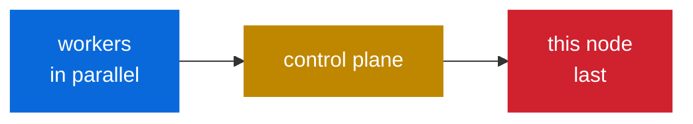
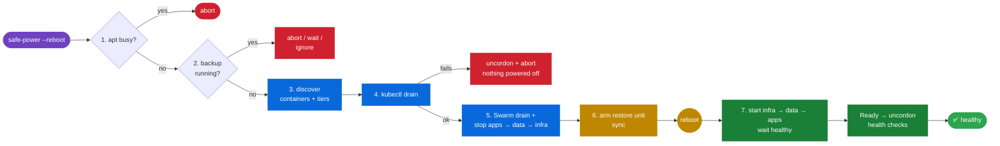

# ⚡ safe-power


-555)

Safe **reboot / shutdown** for the optiplex cluster. It never powers off during a backup, drains Kubernetes, stops Docker containers in a safe order, and puts everything back automatically on boot. Run it on any node, and point it at any node.

| File | Purpose |
|---|---|
| 🟢 **`safe-power`** | Detect backups, drain, then reboot or shut down, then restore. |
| 🔵 **`safe-power-setup`** | One-time setup: service account, SSH keys, sudo rule, Kubernetes permissions, and the man page on every node. |
| 📖 **`safe-power.8`** | Man page: `man safe-power` |

---

## 🚀 Install

> [!IMPORTANT]
> Do this **once** from any node, logged in as your normal admin user. That user needs SSH access and `sudo` on every node. You'll be asked for passwords during setup; after that, nothing asks for a password.

**1. Get the scripts onto any one node**

```bash
git clone https://github.com/BladerunnerxRC/Linux_Shell_Scripts.git
cd Linux_Shell_Scripts/safe-power
```

**2. Run setup with every node's hostname** (the control plane is `optiplex-docker` by default)

```bash
./safe-power-setup optiplex-docker optiplex-two optiplex-three
```

**3. Done ✅** Setup ends by verifying every node. Then:

```bash
man safe-power                    # full reference
safe-power --reboot --dry-run     # see what a reboot of this node would do
safe-power-setup --verify         # re-check the setup any time
```

> [!TIP]
> **Adding a node later:** re-run setup with the full list. It is safe to re-run: it keeps existing keys and never touches `local.conf`.
> ```bash
> safe-power-setup optiplex-docker optiplex-two optiplex-three optiplex-four
> ```

<details>
<summary>⚙️ Setup options</summary>

| Option | Default | Meaning |
|---|---|---|
| `--control-plane HOST` | `optiplex-docker` | Kubernetes control plane |
| `--admin USER` | you | SSH user used during setup |
| `--user NAME` | `safepower` | Service account name |
| `--api-server URL` | from admin kubeconfig | API URL for workers to use (needed if the admin kubeconfig points at `127.0.0.1`) |
| `--ntfy URL` | off | ntfy topic for notifications on every node (kept on re-run, `""` turns it off) |
| `--ntfy-token TOKEN` | | ntfy access token, if your topic needs one (kept on re-run, `""` removes it) |
| `--ha-webhook URL` | off | Home Assistant webhook for notifications on every node (kept on re-run, `""` turns it off) |
| `--no-from` / `--from` | on | Turn the per-key source-address limit off / on (kept on re-run) |
| `--from-extra LIST` | | Extra addresses/CIDRs allowed for every key, e.g. a VPN range |
| `--verify` | | Only run the checks |

</details>

### 🔐 What setup creates on every node

```diff
+ /usr/local/sbin/safe-power                  the tool
+ /usr/local/sbin/safe-power-setup            the installer (so it can be re-run from any node)
+ /usr/local/share/man/man8/safe-power.8      man safe-power
+ /etc/safe-power/cluster.conf                node list + control plane (identical everywhere, rewritten by setup)
+ /etc/safe-power/notify.conf                 ntfy / Home Assistant URLs + token (root-only 0600: they work like passwords)
+ /etc/safe-power/local.conf                  YOUR per-node overrides (created once, never overwritten, root-only 0600)
+ user  safepower                             system account, password locked, key-only login
+ /home/safepower/.ssh/id_ed25519             passphrase-less key (unique per node)
+ /home/safepower/.ssh/authorized_keys        every node's key, locked to the safe-power SSH gate AND to that node's IPs (from=)
+ /home/safepower/.ssh/known_hosts            every node's host key (no trust-on-first-use)
+ /etc/sudoers.d/safe-power                   safepower may run ONLY /usr/local/sbin/safe-power as root
+ /etc/safe-power/kubeconfig                  Kubernetes ServiceAccount token (root:safepower 0640)
```

**Kubernetes** (created on the control plane): ServiceAccount `kube-system/safe-power` bound to ClusterRole `safe-power`, which has only what `kubectl drain` / `uncordon` need:

| Resource | Verbs |
|---|---|
| `nodes` | get, list, patch *(cordon/uncordon)* |
| `pods` | get, list, delete |
| `pods/eviction` | create |
| `daemonsets`, `replicasets`, `statefulsets`, `jobs`, `replicationcontrollers` | get, list |

> [!NOTE]
> **Locked down by design.** Each `safepower` key uses `restrict` and a forced command (`safe-power --ssh-gate`). That means no shell, no port forwarding, and no pty. The gate lets through only:
> - `true`
> - `safe-power --<action> [-y] [--dry-run] [--wait-backups] [--ignore-backups] [--no-evict] [--allow-concurrent]` (no node argument, so a remote call can't hop on to a third node)
> - `kubectl get|drain|cordon|uncordon …`
>
> Anything else is rejected and logged to syslog.

---

## 🕹️ Usage

```bash
safe-power --reboot   [NODE]    # 🔁 drain → reboot → restore on boot
safe-power --shutdown [NODE]    # ⏻  drain → power off → restore at next power-on
safe-power --drain    [NODE]    # 🚰 drain only
safe-power --restore  [NODE]    # ♻️  bring a drained node back (runs automatically on boot)
safe-power --status   [NODE]    # 📊 drained / ok / failed
safe-power --check    [NODE]    # 🩺 verify account, SSH trust, kubectl, mounts
safe-power --needs-reboot [NODE] # 🩺 yes/no: pending updates or a newer kernel?
safe-power --cancel             # 🗑️  cancel runs scheduled with --at

safe-power --reboot   --all     # 🔄 rolling reboot of the whole cluster
safe-power --shutdown --all     # 🔌 power off the whole cluster (UPS / outage)
safe-power --status   --all     # 📊 every node at a glance
safe-power --check    --all     # 🩺 checks on every node
#  … add --workers-only to any --all command to leave the control plane alone
```

| Option | Effect |
|---|---|
| `-y` | Don't ask for confirmation (the red `--all` warning is still shown) |
| `--dry-run` | Show every step, including backup findings and the container shutdown plan, without changing anything |
| `--no-wait` | Don't wait for a remote reboot to finish restoring |
| `--wait-backups` | Wait up to 1 h for running backups to finish instead of aborting |
| `--ignore-backups` | Power off even though a backup is running ⚠️ |
| `--workers-only` | With `--all`: leave the control plane out |
| `--max-time=MIN` | With `--reboot --all`: don't start another node after `MIN` minutes (default 240, `0` = no limit) |
| `--allow-concurrent` | Skip the one-node-down lock ⚠️ |
| `--if-needed` | With `--reboot`: only reboot nodes that need it |
| `--at WHEN` | Run later instead of now: `03:00`, `"tomorrow 02:30"`, `"2026-10-03 04:00"` |

`NODE` defaults to **this host**. It re-runs itself with `sudo`, so you can leave `sudo` off.

### 🌐 Run from any node

```bash
# on optiplex-two: reboot optiplex-three and wait until it's back and uncordoned
safe-power --reboot optiplex-three

# on optiplex-three: check the control plane's state
safe-power --status optiplex-docker
```

The work always runs **on the target node itself**: the calling node connects over SSH as `safepower` and runs that node's own `safe-power`. For a remote `--reboot`, the calling node waits until the target reports its restore is `ok` or `failed`.

### 🔄 Rolling reboot: `--all`

```bash
safe-power --reboot --all --dry-run                  # preview the order
safe-power --reboot --all                            # do it
safe-power --reboot --all --workers-only --max-time=120   # workers only, 2-hour limit
```

Every `--all` reboot or shutdown starts with a **blinking red warning** that lists the nodes, and you have to type `yes`:

```diff
-  ⚠  ROLLING REBOOT OF 4 NODE(S): optiplex-two optiplex-three optiplex-docker optiplex-four  ⚠
-  This affects the whole cluster, starting from optiplex-four.

   Type yes to continue: _
```

Nodes are rebooted **one at a time**, in this order:


1. **Preflight:** every node must be reachable and not already drained, and every Kubernetes node must be `Ready` and schedulable. If any node is already cordoned, nothing starts.
2. **Each other node:** backup check → drain → reboot → wait until it reports `ok` (Ready and uncordoned) → wait `ROLL_PAUSE` seconds (default 60) for workloads to settle → next node.
3. **The node you ran it from goes last**, because rebooting it ends the run. Its restore still runs on boot. Check afterwards with `safe-power --status --all`.

> [!WARNING]
> The rollout **stops** at the first node that doesn't come back healthy, or that is in the middle of a backup (unless you add `--wait-backups`), or once the **time limit** is reached (`ROLL_MAX`, default 4 h). It lists the nodes it didn't start, and the rest of the cluster stays up. Fix the problem, then run `--all` again.

```diff
  == safe-power status — all nodes ==
+   ✔ optiplex-docker      ok restored 2026-09-30 01:12:40
+   ✔ optiplex-two         ok restored 2026-09-30 00:58:03
    ● optiplex-three       drained since 2026-09-30 01:14:22
-   ✘ optiplex-four        failed 1 problem(s) 2026-09-30 00:41:10
```

### 🔌 Cluster shutdown: `--shutdown --all`

For a power outage, or for a UPS to trigger:

```bash
safe-power --shutdown --all --dry-run                   # preview
safe-power --shutdown --all                             # asks you to type yes
/usr/local/sbin/safe-power --shutdown --all -y --ignore-backups   # unattended (UPS)
```



- **Fast:** workers shut down **at the same time**. Nodes are cordoned, **not drained**, because there's nowhere left to move the pods.
- **Still clean:** each node still checks for backups (unless you add `--ignore-backups`) and stops its containers in order: apps, then data, then infra.
- **Best effort:** an unreachable node (probably already off) is skipped, and one node failing doesn't stop the others from powering off.
- **Restore** runs on each node at its next power-on, as usual.

<details>
<summary>🔋 NUT (Network UPS Tools) example</summary>

On the node that talks to the UPS, `/etc/nut/upsmon.conf`:

```ini
SHUTDOWNCMD "/usr/local/sbin/safe-power --shutdown --all -y --ignore-backups"
FINALDELAY 0
```

The other nodes don't need NUT: `safe-power` powers them off over SSH.

</details>

### 🔒 One node down at a time

Before draining, a node **cordons itself and then checks every other node**. If another node is already cordoned or `NotReady`, it uncordons itself and stops:

```diff
- ❌ Not draining optiplex-three: optiplex-two (Ready,SchedulingDisabled) is already cordoned or NotReady.
-    Bring it back first, or use --allow-concurrent.
```

Each node cordons itself **before** checking the other nodes with a consistent Kubernetes read. Competing nodes cannot both pass while both remain cordoned; either or both may back off. A failed cordon, a failed node-list request, or a read that does not confirm this node is cordoned aborts before draining. If rollback cannot uncordon the node, its drained state is kept so you can recover with `safe-power --restore`.

Turn this check off for good with `ONE_AT_A_TIME=0` in `local.conf`, or skip it once with `--allow-concurrent`. Cluster shutdown skips the check because it intentionally powers off several nodes together.

### 🔔 Notifications

Get a message on your phone (ntfy) or in Home Assistant when:

| Event | Level |
|---|---|
| 🔁 Node rebooting / ⏻ powering off / 🚰 drained | info / warn |
| ✅ Restored and healthy | ok |
| ❌ Restore failed | fail |
| 🛑 Aborted: backup running, drain failed, another node down | fail |
| 🔄 Rolling reboot started / complete / stopped (failure or time limit) | info / ok / fail |
| 🔌 Cluster shutdown started / problems | warn / fail |

Turn it on for every node at once:

```bash
safe-power-setup --ntfy https://ntfy.sh/my-cluster-topic
safe-power-setup --ha-webhook http://homeassistant.lan:8123/api/webhook/safe-power
```

<details>
<summary>📨 Details: ntfy token, Home Assistant automation</summary>

**ntfy with an access token.** Pass it to setup, which stores it with the URLs in root-only `/etc/safe-power/notify.conf` on every node:

```bash
safe-power-setup --ntfy https://ntfy.example/safe-power --ntfy-token tk_...
```

Failures are sent with **urgent** priority, so they get past Do Not Disturb.

**Home Assistant** gets a JSON POST: `{"node", "level", "title", "message"}`. Example automation:

```yaml
automation:
  - alias: safe-power notifications
    trigger:
      - platform: webhook
        webhook_id: safe-power
        local_only: true
    action:
      - service: notify.mobile_app_my_phone
        data:
          title: "safe-power: {{ trigger.json.title }}"
          message: "[{{ trigger.json.node }}] {{ trigger.json.message }}"
```

</details>

Notifications never fail a run, and are never sent during `--dry-run`.

Notification failures do not print the endpoints or tokens. Home Assistant messages escape JSON control characters, including tabs and carriage returns.

### Regression checks for PR1

These checks stub the cluster and power commands and use temporary state files. They do not reboot or shut down a real node:

```bash
bash safe-power/tests/pr1-regressions.bash  # from the repository root
```

They cover failed cordons and node reads, rollback failures, dry-run state preservation, the concurrency override, shutdown without eviction, rollout preflight, deadline-capped sleeps, and notification encoding/redaction. Live cluster verification is still needed before deployment.

### 🩺 Reboot only when needed: `--if-needed`

```bash
safe-power --needs-reboot --all             # who needs one?
safe-power --reboot --all --if-needed       # rolling reboot of just those nodes
```

```diff
  == Reboot needed? ==
!   ● optiplex-docker      yes — updates need a reboot (linux-image-6.8.0-45 libc6)
+   ✔ optiplex-two         no
!   ● optiplex-three       yes — kernel 6.8.0-45-generic installed, 6.8.0-40-generic running
```

A node **needs a reboot** when any of these is true:

| Check | Distro |
|---|---|
| `/var/run/reboot-required` exists | Debian / Ubuntu (unattended-upgrades) |
| `needs-restarting -r` says so | RHEL / Fedora / Rocky |
| a newer `vmlinuz-*` is in `/boot` than the kernel running | any |

### 🗓️ Schedule it: `--at`

```bash
safe-power --reboot --all --if-needed --at 03:00     # tonight, only nodes that need it
safe-power --reboot optiplex-three --at "tomorrow 02:30"
safe-power --status                                  # shows what's scheduled
safe-power --cancel                                  # cancel it
```

- You confirm **now** (including the red warning for `--all`), and the scheduled run gets `-y`.
- It runs as a one-shot systemd timer (`safe-power-at-*`) on the node where you typed it. A bare time that has already passed today means tomorrow.
- Rebooting the scheduling node before then cancels the timer.

> [!TIP]
> **Hands-off patching.** Let `unattended-upgrades` install updates, and have a weekly cron job on any node run `safe-power --reboot --all --if-needed -y`. Only nodes with new kernels or libraries reboot, one at a time, and each one waits until the one before it is healthy.

---

## 🧭 What it does

The node's role is worked out from its hostname, using `CONTROL_PLANE_HOST` in `cluster.conf`.



| Phase | 🟣 Control plane (`optiplex-docker`) | 🔵 Worker (`optiplex-three`, …) |
|---|---|---|
| **1. Preflight** | abort if `apt`/`dpkg` is running | same |
| **2. Backups** | abort / wait if a backup is running | same |
| **3. Discover** | list local containers and assign tiers | same |
| **4. Kubernetes** | `kubectl drain` self | `kubectl drain <node> --ignore-daemonsets --delete-emptydir-data` |
| **5. Docker** | Swarm drain, then stop containers by tier | stop containers by tier |
| **6. Power** | `sync`, then reboot or power off | same |
| **7. Restore** *(on boot)* | start containers by tier → Ready → `kubectl uncordon` → Swarm services → `HEALTH_URLS` | start containers by tier → Ready → `kubectl uncordon` |

### 💾 Backup detection (phase 2)

Before touching anything, it looks for a backup in progress on the node:

| Source | Matched by | Examples |
|---|---|---|
| 🔍 Processes, **including inside containers** (reported with the container name) | `BACKUP_PROCS` | `restic`, `borg`, `kopia`, `vzdump`, `veeamagent`, `pg_dump`, `mysqldump`, `mariabackup` |
| 📜 Backup scripts | `BACKUP_CMDLINE` | `backup.sh`, `docker_backup` |
| ⚙️ systemd services that are still running | `BACKUP_UNITS` | `borgmatic.service`, `restic-backup.service` |
| 🐳 One-shot backup containers | `BLOCKING_CONTAINERS` | `backup-job` |

Long-running daemons such as `kopia server` and `restic mount` are ignored (`BACKUP_IGNORE`). If a backup is found:

```diff
- default            abort, nothing is touched
! --wait-backups     wait up to 1 h (or BACKUP_WAIT seconds), checking every 30 s
- --ignore-backups   carry on anyway
```

### 🐳 Container shutdown order (phase 3 + 5)

It finds every running container this node must stop itself. Swarm tasks are left to the Swarm drain, and Kubernetes pods to `kubectl drain`. Containers are stopped in tiers, so apps finish writing before their databases go away:

| Tier | Stopped | Started on boot | What | Timeout |
|---|---|---|---|---|
| 🟦 **1 apps** | 1st | 3rd | everything else | `STOP_TIMEOUT` 60 s |
| 🟨 **2 data** | 2nd | 2nd | postgres, mariadb, mysql, mongo, redis, influxdb, mosquitto, rabbitmq … | `DB_STOP_TIMEOUT` 120 s |
| 🟥 **3 infra** | 3rd | 1st | pihole, adguard, traefik, caddy, portainer, tailscale, cloudflared … | `STOP_TIMEOUT` 60 s |

- Tiers are guessed from the image's own name, so `bitnami/postgresql:16` is data but `redis_exporter` is an app.
- On boot, each tier waits (up to `HEALTH_WAIT`) for its containers' healthchecks to pass before the next tier starts.
- A container that had to be **killed** after its timeout is flagged, because it may not have shut down cleanly.

Override the guess with a container label:

```yaml
labels:
  safe-power.tier: "2"      # treat as a database
  # safe-power.skip: "true" # never stop this one
```

### 🛡️ Safety checks

- 🚫 Refuses to run while `apt`/`dpkg` is running, or while a **backup** is running.
- ↩️ If `kubectl drain` fails (a PodDisruptionBudget or a stuck pod), it **uncordons and aborts**, and nothing is powered off.
- 🚫 A worker with no `kubectl` access refuses to power off while still undrained.
- 🐢 Databases get more time to stop, and are stopped after the apps that use them.
- 🔒 **One node down at a time:** refuses to drain while another node is cordoned or `NotReady`.
- 🚨 A reboot or shutdown of the whole cluster (`--all`) shows a **blinking red warning** and needs a typed `yes`.
- ⏱️ Rolling reboots have a **time limit** (`ROLL_MAX`, default 4 h).
- 📂 After boot, **required mounts** (e.g. the NAS backup share) must be up **before** any container starts. If one is missing, the node stays drained until it is fixed.
- 🔑 Each node's SSH key only works **from that node's own IP addresses** (`from=`).
- ⚠️ Warns before shutting down the control plane.
- 🧹 The restore step is a one-shot systemd unit (`safe-power-restore.service`) that removes itself when it's done.

---

## 📜 Logs

| Where | What |
|---|---|
| **`/var/log/safe-power.log`** | Everything on **the node doing the work**: backup findings, container plan, drain, stops, restore. Plain text, no color codes. |
| Caller's `/var/log/safe-power.log` | For remote and `--all` runs, the calling node logs its side (what it sent, the waits) too |
| `journalctl -u safe-power-restore` | The restore that runs at boot (also appended to the log above) |
| `journalctl -t safe-power` | Commands the SSH gate rejected |

```bash
tail -f /var/log/safe-power.log                                  # follow a run
ssh optiplex-three tail -n 50 /var/log/safe-power.log            # another node (with your own account)
journalctl -u safe-power-restore -b                              # this boot's restore
```

## 📁 Files

| Path | What |
|---|---|
| `/var/lib/safe-power/` | State: `containers.txt` (tier + name), `drained_at`, `last_result`, `swarm_node_id` |
| `/etc/safe-power/cluster.conf` | Node list, control plane, service account. Rewritten by setup |
| `/etc/safe-power/notify.conf` | Notification URLs + token. Root-only (0600), rewritten by setup |
| `/etc/safe-power/local.conf` | **Your overrides for this node.** Never overwritten. Root-only (0600) |

Every setting at the top of `safe-power` can be overridden in `local.conf`. For example:

```bash
# /etc/safe-power/local.conf on optiplex-docker
HEALTH_URLS=("http://localhost:7171" "http://localhost:3000" "http://localhost:8080")
REQUIRED_MOUNTS=("/mnt/nas_backups" "/mnt/restic-backups")   # must be up before containers start
BLOCKING_CONTAINERS=("backup-job" "nightly-dump")
BACKUP_WAIT=1800
DB_STOP_TIMEOUT=180
```

## 🩹 Troubleshooting

| Symptom | Fix |
|---|---|
| `💾 Backup in progress` but nothing is backing up | Check the listed process. Add it to `BACKUP_IGNORE` in `local.conf`, or use `--ignore-backups` once |
| `⚠️ X didn't stop within 60s and was killed` | Give it more time: label it `safe-power.tier=2` (120 s), or raise `STOP_TIMEOUT` |
| Container in the wrong tier | Add the label `safe-power.tier=1`, `2` or `3` |
| `✘ ssh safepower → nodeX` | Run `safe-power-setup --verify`. Check that the hostname resolves, and check `AllowUsers` in `sshd_config` |
| `✘ kubectl access` | Re-run setup with `--api-server https://<control-plane-ip>:6443` |
| `🛑 Not starting containers or uncordoning` after boot (mount missing) | The node is left drained on purpose. Check the NAS and `/etc/fstab`, run `mount /mnt/…`, then `safe-power --restore` |
| `✘ ssh safepower → nodeX` after a node's IP changed | Re-run `safe-power-setup`: the `from=` addresses are taken at setup time |
| Node left cordoned after boot | `safe-power --status NODE`, check the log on that node, then `safe-power --restore NODE` |
| Host key changed (node rebuilt) | Re-run `safe-power-setup` with all nodes |

---

## 🗺️ Roadmap

| | Idea | Why |
|---|---|---|
| 🧪 | **shellcheck + bats tests** in GitHub Actions | Catch regressions before they reach the cluster |
| 📖 | **Merge the v1 `COMMAND_scripts/safe-power`** once smiddleware moves to v2 | One `safe-power` command on every host |

See `man safe-power` for the full reference.
